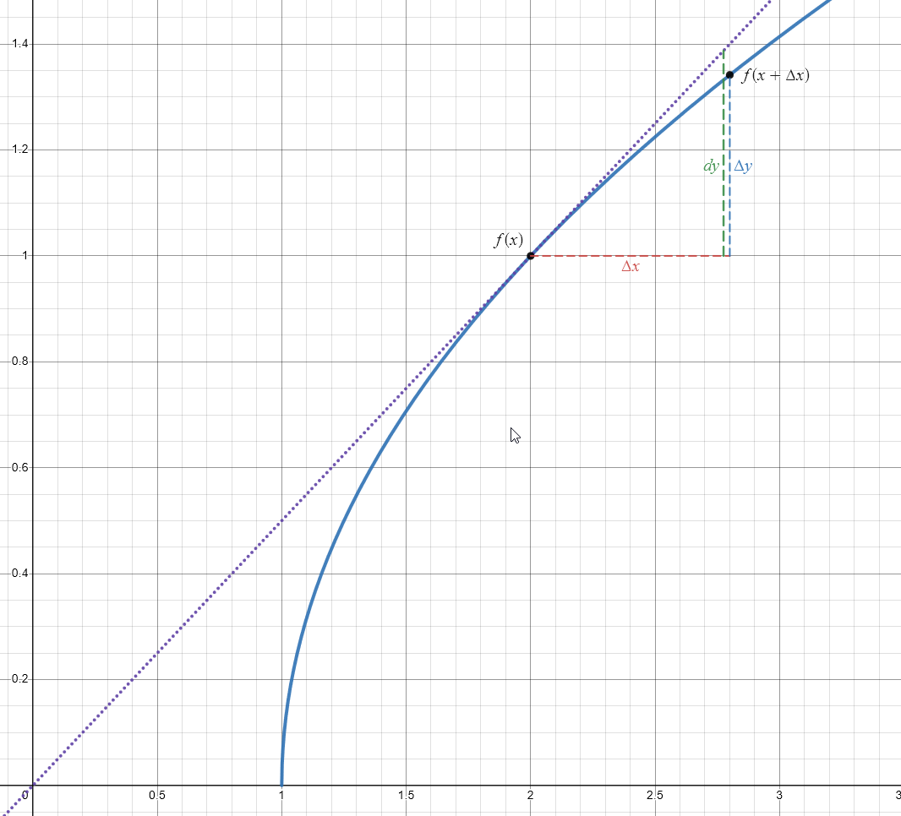

## Linear Approximation
For a function $f$ and known values for $f(a)$ and $f'(a)$ at $x=a$, we can create an approximation for $f$ in the neighborhood of $a$: $$
L(x)=f(a)+f'(a)\cdot(x-a)
$$
We are essentially taking the value of $f$ at $x=a$ and pretending its instantaneous rate of change ($f'(a)$) extends everywhere else

### Example
**Find the linear approximation $L(x)$ of the function $f(x) = \sqrt{1-x}$ at $a=0$.**
$$f(0) = \sqrt{1-0} = 1$$
$$f'(0) = -\frac{1}{2\sqrt{1-0}} = -\frac{1}{2}$$
$$L(x) = 1 - \frac{1}{2}(x-0) = 1-\frac{1}{2}x$$

### Example
**Use a linear approximation (or differentials) to estimate $(1.999)^4$:**

With linear approximation:
$$f(x) = x^4, f'(x) = 4x^3, a = 2$$
$$L(x)=2^4+4(2)^3\cdot(x-2)=16+32(x-2)$$
$$L(1.999) = 16+32(-0.001) = 15.968$$

## Differentials
The differential expresses how a function $y = f(x)$ of $x$ changes when $x$ changes infinitesimally (i.e. how small changes of $x$ produce a change in $y$).

We calculate it effectively by calculating the derivative of $y$ and multiplying it by $dx$ (it's kind of an abuse of our $\frac{dy}{dx} = f'(x)$ notation): $$dy = f'(x)\,dx$$
The differential $dy$ gives us an approximation of how a function changes in the small neighborhood around a point, similar to a linear approximation:
$$f(x+\Delta x) \approx f(x)+f'(x)\cdot\Delta x$$
The difference between a differential and a linear approximation is that the differential $dy$ can kind of be framed as a function $dy(x, dx)$ while a linear approximation applies that function.

### $dy$ vs $\Delta y$
$dy$ is an approximation of how a function changes around a point based on its derivative:
$$dy = f'(x)\,\Delta x = \left(\frac{dy}{dx}\right)\Delta x$$ (Here $\Delta x$ is taking the place of $dx$, representing a small, but discrete, change in $x$: we use $d$ to notate an infinitely small change and $\Delta$ to notate a finitely small change)

Meanwhile, $\Delta y$ tells us the actual change in the value of $f$ with a change ($\Delta x$) in $x$:
$$\Delta y = f(x+\Delta x)-f(x)$$

### Example
**Find the differential of the function $y = \theta^4\sin(8\theta)$.**
$$\frac{dy}{dx}=4\theta^3\sin(8\theta)+8\theta^4\cos(8\theta)$$
$$dy = 4\theta^3\sin(8\theta)+8\theta^4\cos(8\theta)\,dx$$

### Example
**Compute $\Delta y$ and $dy$ for the given values of $x$ and $dx = \Delta x$. (Round to three decimal places)**
$y = \sqrt{x-1}, x = 2, \Delta x = 0.8$

$$\Delta y = \sqrt{(2 + 0.8) - 1} - \sqrt{2 - 1} = \sqrt{1.8} - \sqrt{1} = 1.341 - 1 = 0.341$$
$$dy = \frac{1}{2\sqrt{2-1}}\cdot0.8 = \frac{1}{2}\cdot 0.8 = 0.4$$

### Example
**Use differentials to estimate $(1.999)^4$:**
$$y = x^4$$
$$dy = 4x^3\,dx = 4(2)^3\cdot(-0.001)=-0.032$$
$$(1.999)^4 \approx 2^4 - 0.032 = 15.968$$

## Hyperbolic Functions
$$\sinh x= \frac{e^x-e^{-x}}{2}$$
$$\cosh{x} = \frac{e^x+e^{-x}}{2}$$
$$\tanh{x}=\frac{\sinh x}{\cosh x} = \frac{e^x-e^{-x}}{e^x+e^{-x}}$$
Helpful: $\sinh$ has a negative because it's an odd function like $\sin$: $$
\sinh(-x)=-\sinh(x)\approx\sin(-x)=-\sin{x}
$$ $\cosh$ has a positive because it's an even function like $\cos$: $$\cosh(-x) = +\cosh(x)\approx\cos(-x)=+\cos(x)$$

## Misc. Exercises

### Numerical Value of $\cosh(\ln 8)$
$$\cosh{\ln 8} = \frac{e^{\ln 8} + e^{-\ln 8}}{2} = \frac{8 + \frac{1}{8}}{2} = 4+\frac{1}{16}$$

### Numerical value of $\cosh(8)$
$$\cosh{8} = \frac{e^8+e^{-8}}{2} = \frac{2980.95799 + \frac{1}{2980.95799}}{2}=1490.47916$$

### Differentials Error
The circumference of a sphere was measured to be $70\text{cm}$ with a possible error of $0.5\text{cm}$.

**a) Use differentials to estimate the maximum error (in $\text{cm}^2$) in the calculated surface area (round to the nearest integer).**
$$\text{SA}=4\pi r^2$$
However, we have been given the circumference, so it might be convenient to rephrase in terms of circumference:
$$C = 2\pi r$$
$$\text{SA}=\frac{C^2}{\pi}$$
$$d\,\text{SA}=\frac{2}{\pi}C\,dC$$
We find the maximum error by substituting in the maximum possible error for the circumference and the given measurement:
$$E_\text{max}=d\,\text{SA}=\frac{2}{\pi}\cdot70\cdot0.5=22\text{cm}^2$$

**What is the relative error?**

$$
E_\text{rel}=\frac{d\,\text{SA}}{\text{SA}}=\frac{\frac{2}{\pi}C\,dC}{\frac{C^2}{\pi}}=\frac{2\,dC}{C}=\frac{2\cdot0.5}{70}=0.014
$$
Alternatively, we can calculate the surface area for the measured circumference and divide directly using the maximum error from the last step:
$$
\text{SA}=\frac{70^2}{\pi}=1560\text{cm}^2
$$
$$
E_\text{rel}=\frac{d\,\text{SA}}{\text{SA}}=\frac{22}{1560}=0.014
$$

**b) Use differentials to estimate the maximum error (in $\text{cm}^3$) in the calculated volume (round to the nearest integer).**

$$V=\frac{4}{3}\pi r^3$$
Again in terms of circumference:
$$
C^3=8\pi^3r^3
$$
$$V=\frac{1}{6\pi^2}C^3$$
$$dV=\frac{1}{2\pi^2}C^2\,dC$$
$$E_\text{max}=dV=\frac{1}{2\pi^2}(70^2)\cdot0.5=124\text{cm}^3$$

**What is the relative error?**
$$E_\text{rel}=\frac{dV}{V}=\frac{\frac{1}{2\pi^2}C^2\,dC}{\frac{1}{6\pi^2}C^3}=\frac{3dC}{C}=\frac{3\cdot0.5}{70}=0.021$$
Or:
$$V=\frac{1}{6\pi^2}70^3=5792\text{cm}^3$$
$$
E_\text{rel}=\frac{dV}{V}=\frac{124}{5792}=0.021
$$

### Rewriting $\sinh(7\ln{x})$
**Write $\sinh(7\ln{x})$ as a rational function of $x$.**
$$\sinh(7\ln x)=\frac{e^{7\ln x}-e^{-7\ln x}}{2}=\frac{(e^{\ln x})^7-(e^{\ln x})^{-7}}{2}=\frac{x^7-x^{-7}}{2}$$

### More hyperbolics
**Write $6\sinh{x}+3\cosh{x}$ in terms of $e^x$ and $e^{-x}$.**
$$
6\sinh{x}+3\cosh{x}=6\left(\frac{e^x-e^{-x}}{2}\right)+3\left(\frac{e^x+e^{-x}}{2}\right)=\frac{9e^x-3e^{-x}}{2}
$$
